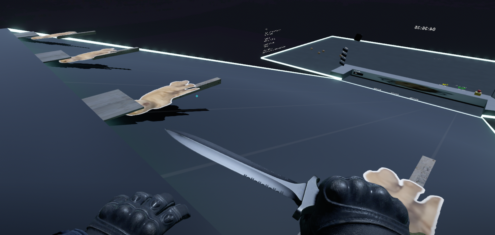

# mg_hachimi community hotfix

Unofficial compatibility hotfix for Workshop item `3500104891`.

It restores target movement and orientation, song-list scrolling and hit-area alignment, monitor titles, and judge-tip visibility. It also removes leaked debug/save text. An optional edition adds the community-submitted **Unwelcome ChiMi** chart.

## Visual check

| Before: targets stuck and lying on the track | After: upright, fully visible, and flowing through autoplay |
| --- | --- |
|  |  |

## Install

[Download from Releases](https://github.com/WSL043/mg_hachimi/releases)

1. Subscribe to Workshop item `3500104891` and let Steam finish downloading it.
2. Download and extract the current hotfix release.
3. Run `community-hotfix/Install.cmd` and choose **Fix only** or **Fix + preview songs**.
4. Run `community-hotfix/Launch.cmd`, then choose Perfect World or Worldwide.

The installer makes a verified rollback backup and directly patches the already-subscribed Workshop VPKs, so no second map subscription or Workshop Tools mode is needed. It refuses unknown map versions. `Uninstall.cmd` restores the verified original Workshop files; `Diagnostics.cmd` creates a support ZIP for [Issue reports](https://github.com/WSL043/mg_hachimi/issues).

Installation is normally one-time. The launcher checks hashes on each run and only reapplies the selected edition if Steam restored the exact supported original Workshop files.

- [Detailed English instructions](community-hotfix/README.md)
- [中文说明](community-hotfix/README.zh-CN.md)

## Support

For a reproducible problem, run `community-hotfix/Diagnostics.cmd` and open a [new Issue](https://github.com/WSL043/mg_hachimi/issues) with the generated ZIP, a screenshot if relevant, and the action that triggered it.
